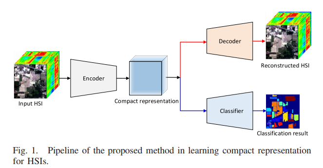
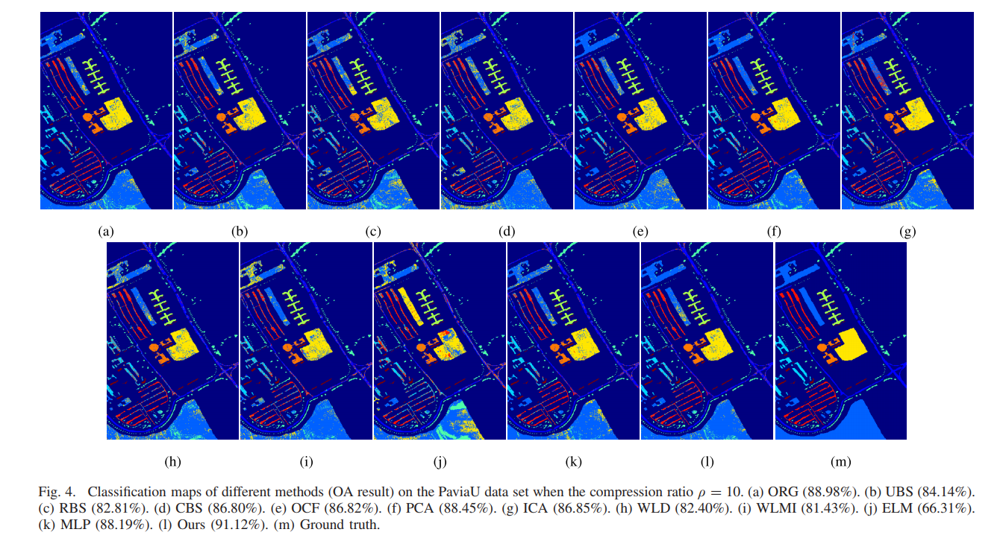

This is the implementation of Learning Discriminative Compact Representation(LDCR) for Hyperspectral Imagery Classification

(https://ieeexplore.ieee.org/document/8741172)

Abstract

Abundant spectral information of hyperspectral images (HSIs) has shown an obvious advantage in improving the performance of classification in the remote sensing domain. However, this is paid by the expensive consumption on the computation, transmission, as well as storage of HSIs. To address this problem, we propose to learn the discriminative compact representation for HSIs classification, which not only greatly reduces the data redundancy in the image but also preserves the discriminative information required for pixelwise classification in HSIs. To this end, we present a multi-task deep learning framework, which integrates HSIs autoencoding and classification into a two-branch deep neural network for jointly learning. In the network, we employ an encoder block to learn the compact representation of the input HSI via compression in the spectral domain. Being fed with the compact representation, the autoencoding branch then employs a decoder block to reconstruct the input HSI, while the classification branch utilizes a classifier block to predict the label for each pixel. Through end-to-end joint learning, the compact representation is not only informative enough to accurately reconstruct the original HSI but also discriminative enough to appropriately label each pixel with the trained classier. Sufficient experimental results on four HSIs classification data sets demonstrate the effectiveness of the proposed framework.


Datasets can be downloaded in (http://www.ehu.eus/ccwintco/index.php?title=Hyperspectral_Remote_Sensing_Scenes)

For training, set the load model as False, and give the paviaU dataset in the data_path.

requirement:
```
tesnorflow 1.11.0
scipy 1.0.0
```

Some results of classification and residual map for recovery data.

Framework



Classification map on PaviaU



Reaidual recovery map on PaviaU


```
L. Zhang, J. Zhang, W. Wei and Y. Zhang, "Learning Discriminative Compact Representation for Hyperspectral Imagery Classification," in IEEE Transactions on Geoscience and Remote Sensing.
doi: 10.1109/TGRS.2019.2919938
```

## tip: we just use spectral information for HSI classification. Network structures may have a slightly different for different datasets due to the different spectral dimension.